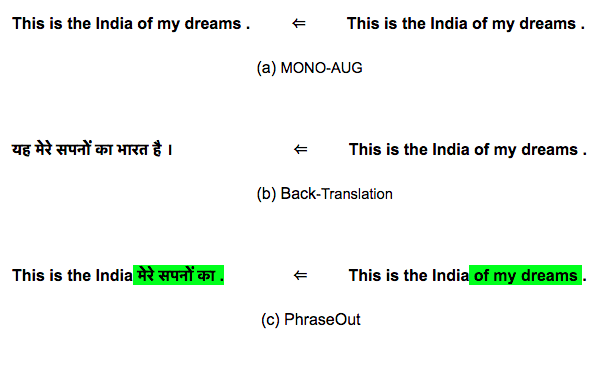

# phraseOut
Code Mixed Data Augmentation for NMT

## 14 May 2019

The procedure to run the experiments is described below

**Step 1**: Run Moses to get the phrase tables with `--last-step` as 6. See [my guide to moses](http://cslab.org/blog/moses-basics).

**Step 2**: Run `get_lex_dict_en.py` to get the unigram lexical mappings.

**Step 3**: Run `anaylze_phrase_table.py` to get a unique phrase table which maps to the most probable target phrase.

**Step 4**: Run `create_ngram_dict_pht.py` to create bigram & trigram dictionaries.

**Step 5**: Run `replace_sent_en.py` to replace a monolingual sentence with phrases from these dictionaries.

Now use [fairseq scripts](https://github.com/bnjasim/research/blob/master/2019/05_may/fairseq_multi.sh) to train the model.

We use `adam` optimizer. The detailed hyper-parameters are in the file: `fairseq_keep_training.sh`.
